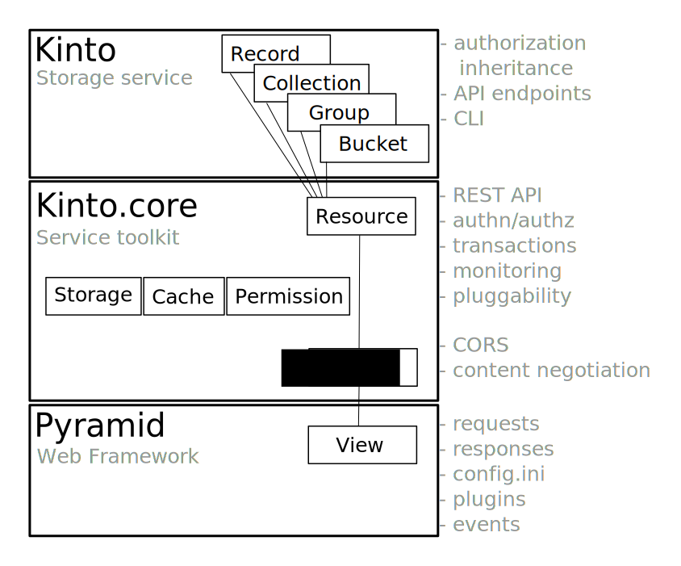

.. _kinto-concepts:

Concepts
########

Basically, *Kinto* is a service where client applications can store and retrieve JSON data.

In order to provide synchronisation and sharing features for these data, *Kinto*
introduces some basic concepts.

*Kinto* objects in brief:

+-----------------+---------------------------------------------------------+
| Object          | Description                                             |
+=================+=========================================================+
| **bucket**      | Buckets can be seen as namespaces:                      |
|                 | collection names won't collide if stored in different   |
|                 | buckets.                                                |
+-----------------+---------------------------------------------------------+
| **collection**  | A collection of records                                 |
+-----------------+---------------------------------------------------------+
| **record**      | The actual stored data                                  |
+-----------------+---------------------------------------------------------+
| **group**       | A named list of :ref:`principals <api-principals>` to   |
|                 | define permissions.                                     |
+-----------------+---------------------------------------------------------+

.. _concepts-buckets-collections-records:

Buckets, Collections, and Records
=================================

A **record** is the smallest unit of data. By default, there is no schema,
and the JSON can contain anything.

A **collection** is a group of records. Records are manipulated as a list
and can be filtered or sorted. Clients can obtain the list of changes that
occured on the collection records since a certain revision (e.g. *last synchronisation*).
A JSON schema can optionally be defined on the collection.

A **bucket** is an abstract notion used to organize collections and their
permissions.

.. image:: images/concepts-general.png

Every kind of object manipulated by *Kinto* shares some common properties:

* A unique identifier.
* A revision number, automatically incremented on change.
* A set of permissions.

Those concepts are very similar to a hard disk, where buckets would be partitions,
collections are folders, and records are files!

.. _concepts-groups:

Groups
======

Kinto has a concept of *groups* of users. A group has a list of members and
belongs to a bucket.

Permissions can refer to the *group* URI instead of an individual user - this makes
it easy to define "roles", especially if the same set of permissions is applied
to several objects.

.. _concepts-authentication:

Authentication
==============

Kinto reads the request headers in order to authenticate the incoming request and assign a :term:`user id`.
It can rely on a third-party called "`Identity provider <https://en.wikipedia.org/wiki/Identity_provider>`_"
like *Auth0*, *GitHub* or *Google*.

.. _concepts-permissions:

Permissions
===========

In order to control who is allowed to read, create, modify, or delete the records,
permissions can be defined on buckets, groups, collections, and single records.

Inherited
---------

Since there is a notion of hierarchy between buckets, collections, and records,
*Kinto* considers permissions as inherited from parent objects.

.. image:: images/concepts-permissions.png

For example, if a bucket defines a permission that allows anonymous users to read,
then every record of every collection in this bucket will also be readable, as
a result of inheritance.

The permission to create new objects is defined in the parent.
For example, the permission to create records is defined in the collection, and the permission
to create collections or groups is defined in the bucket. The permission to create new buckets,
however, is controlled from the :ref:`server configuration <configuration>`.

.. note::

    If a parent defines a permission, it is (*currently*) not possible to restrict
    it in its child objects.

See also
---------

* :term:`Kinto glossary <CRUD>`, for formal definitions of terms used in the documentation
* :ref:`HTTP API reference documentation <api-permissions>`
* :blog:`Our blog post <en/handling-permissions>` on permissions design in *Kinto*

.. _technical-architecture:

Technical Architecture
======================

Every concept of bucket, group, collection or record is a REST
*resource* and behaves according to the conventions of a resource.

*Kinto* relies on :rtd:`Cornice <cornice>` and :rtd:`Pyramid <pyramid>`
to implement the endpoints and HTTP request/response handling.

Sequence diagrams
-----------------

The following sequence diagram gives a rough overview of how *Kinto* handles
a request and stores it into the storage:

.. https://www.websequencediagrams.com

.. title PUT Request → Response cycle

.. Client->WSGI: HTTP PUT request
.. WSGI->Pyramid: WebOb request
.. Pyramid->Kinto: Match route
.. Kinto->Resource: put()
.. Resource->Storage: create_record()
.. Storage->PostgreSQL: SQL INSERT
.. PostgreSQL->Storage: timestamp
.. Storage->Resource: record
.. Resource->Listeners: send notifications
.. Resource->Pyramid: Python dict
.. Pyramid->WSGI: WebOb response
.. WSGI->Client: HTTP response

.. image:: images/sequence-storage.png
