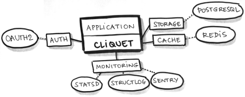

Rationale
#########

*Kinto-Core* is a toolkit to ease the implementation of HTTP `microservices`_.
It is mainly focused on data-driven REST APIs (aka :term:`CRUD`).

.. _microservices: http://en.wikipedia.org/wiki/Microservices

Philosophy
==========

* :term:`KISS`;
* No magic;
* Works with defaults;
* Easy customization;
* Straightforward component substitution.

*Kinto-Core* doesn't try to be a framework: any project built with *Kinto-Core* will
expose a well defined HTTP API for:

* Collection and records manipulation;
* HTTP status and headers handling;
* API versioning and deprecation;
* Errors formatting.

:ref:`This HTTP API <kinto-api-endpoints>` is an implementation of a series of good
practices (followed at `Mozilla Services`_ and `elsewhere`_).

.. _Mozilla Services: https://wiki.mozilla.org/CloudServices
.. _elsewhere: http://www.vinaysahni.com/best-practices-for-a-pragmatic-restful-api

The goal is to produce standardized APIs, which follow some
well known patterns, encouraging genericity in clients code [#]_.

Of course, *Kinto-Core* can be :term:`extended <extensible>` and customized in
many ways. It can also be used in any kind of project, for its tooling, utilities
and helpers.

Features
========

It is built around the notion of resources: resources are defined by sub-classing,
and *Kinto-Core* brings up the HTTP endpoints automatically.

Records and synchronization
---------------------------

* Collection of records by user;
* Optional validation from schema;
* Sorting and filtering;
* Pagination using continuation tokens;
* Polling for collection changes;
* Record race conditions handling using preconditions headers;
* Notifications channel (e.g. run asynchronous tasks on changes).

Generic endpoints
-----------------

* Hello view at root url;
* Heartbeat for monitoring;
* Batch operations;
* API versioning and deprecation;
* Errors formatting;
* ``Backoff`` and ``Retry-After`` headers.

Toolkit
-------

.. figure:: images/cliquet-base.png
    :align: center

    *Kinto-Core* brings a set of simple but essential features to build APIs.

* Configuration through INI files or environment variables;
* Pluggable storage and cache backends;
* Pluggable authentication and user groups management;
* Pluggable authorization and permissions management;
* Structured logging;
* Monitoring tools;
* Profiling tools.

:term:`Pluggable` components can be replaced by another one via configuration.

Dependencies
============

*Kinto-Core* is built on the shoulders of giants:

* :rtd:`Cornice <cornice>` for the REST helpers;
* :rtd:`Pyramid <pyramid>` for the heavy HTTP stuff;
* `SQLAlchemy <http://docs.sqlalchemy.org>`_ core, for database sessions and
  pooling;

Everything else is meant to be **pluggable and optional**.

    Examples of configuration for a *Kinto-Core* application in production.

* *Basic Auth*, *FxA OAuth2* or any other source of authentication;
* *Default* or custom class for authorization logics;
* *PostgreSQL* for storage;
* *Redis* for key-value cache with expiration;
* *StatsD* metrics;
* *Sentry* reporting via logging;
* *NewRelic* database profiling (*for development*);
* *Werkzeug* Python code profiling (*for development*).

A *Kinto-Core* application can change or force default values for any setting.

Built with Kinto-Core
=====================

Some applications in the wild built with *Kinto-Core*:

* :rtd:`Reading List <readinglist>`, a service to synchronize articles between
  devices;
* :rtd:`Kinto <kinto>`, a service to store and synchronize schema-less data.
* :rtd:`Syncto <syncto>`, a service to access *Firefox Sync* using *kinto.js*.
* *Please contact us to add yours*.

Any application built with *Kinto-Core*:

* follows the same conventions regarding the HTTP API;
* takes advantage of its component :term:`pluggability <pluggable>`;
* can be :term:`extended <extensible>` using custom code or Pyramid external
  packages;

Similar projects
================

* `Python Eve <http://python-eve.org/>`_, built on Flask and MongoDB;
* *Please contact us to add more if any*.

Since the HTTP API is language independant and follows good HTTP/REST principles,
in the long term *Kinto-Core* should become only one among several server implementations.

.. note::

    We encourage you to implement a clone of this project — using Node.js, Asyncio,
    Go, Twisted, Django or anything else — following :ref:`the same HTTP API <kinto-api-endpoints>`!

.. [#] Switch from custom API to `JSON-API spec`_ is `being discussed`_.

.. _JSON-API spec: http://jsonapi.org/
.. _being discussed: https://github.com/mozilla-services/cliquet/issues/254

