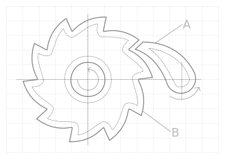

.. include:: ../README.rst

    A cliquet, or ratchet, is a mechanical device that allows continuous linear
    or rotary motion in only one direction while preventing motion in the
    opposite direction.

Table of content
================

.. toctree::
   :maxdepth: 1

   rationale
   installation
   quickstart
   configuration
   resource
   storage
   cache
   errors
   contributing
   glossary
   api/index
   changelog
   contributors

Indices and tables
==================

* :ref:`genindex`
* :ref:`modindex`
* :ref:`search`
