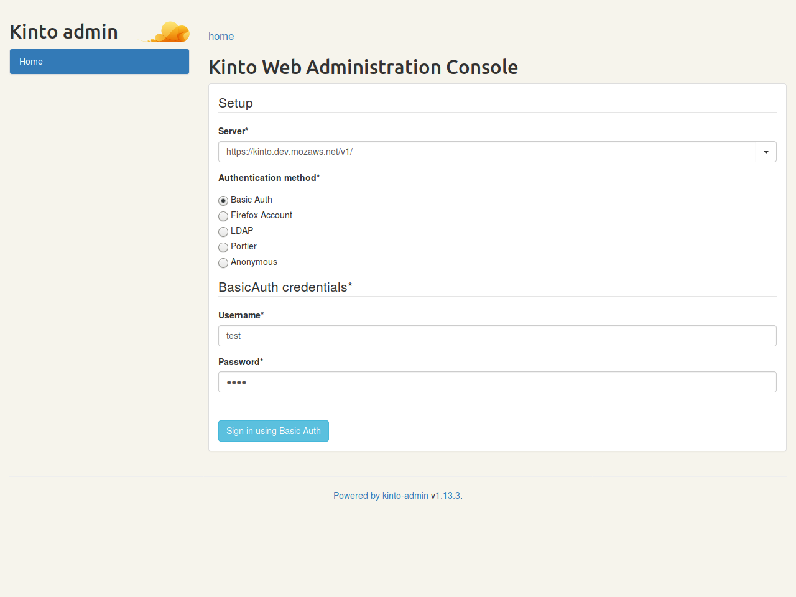
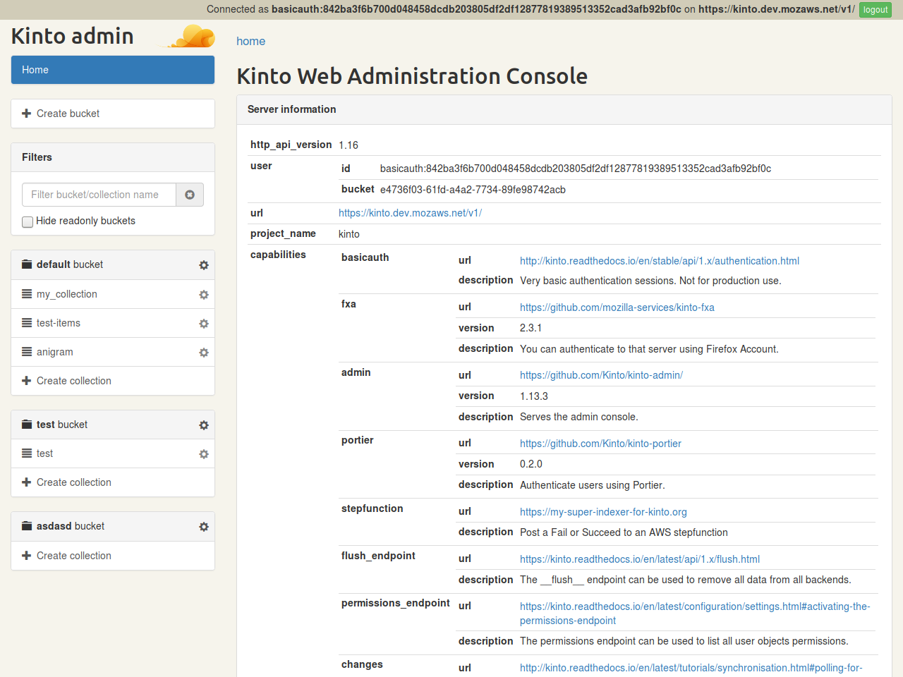
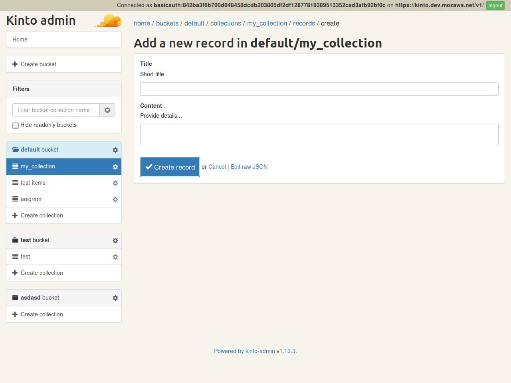
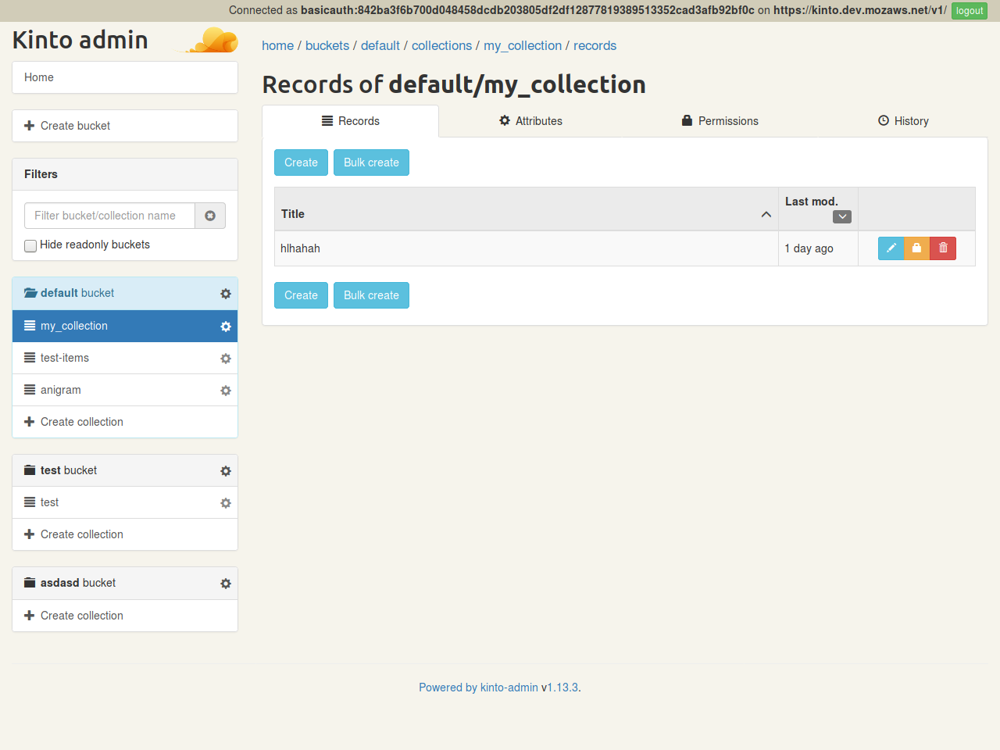

.. _kinto-admin:

Kinto Admin
###########

When the built-in plugin ``kinto.plugins.admin`` is enabled in
configuration, a Web admin UI is available at ``/v1/admin/``.

* :github:`See dedicated repo <Kinto/kinto-admin/>`

