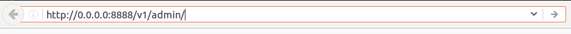
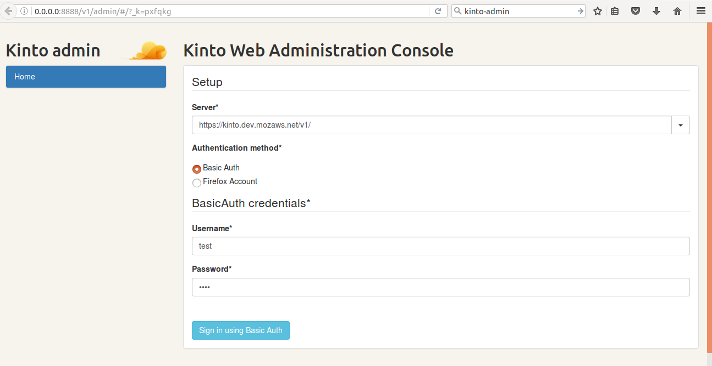

.. _kinto-plugins-admin:

Kinto-Plugins-Admin
###################

It is a Web admin UI to manage data from a Kinto server.

How  to enable it?
==================

It is possible to extend the default Kinto behaviors by using “plugins”.

Plugins are loaded at startup can be specified in the settings(kinto/config/kinto.ini), as a list of Python modules.
Add the following lines of code in the *kinto.ini* file.

::

    kinto.includes = kinto.plugins.default_bucket
                     kinto.plugins.history
                     kinto-attachment
                     custom-myplugin

How to access it?
=================

In order to run the Kinto Web Administration console ,first start the kinto server using following commands.

::

    $ kinto init
    $ kinto migrate
    $ kinto start

Go to the link *http://0.0.0.0:8888/v1/admin/* to access the console.

