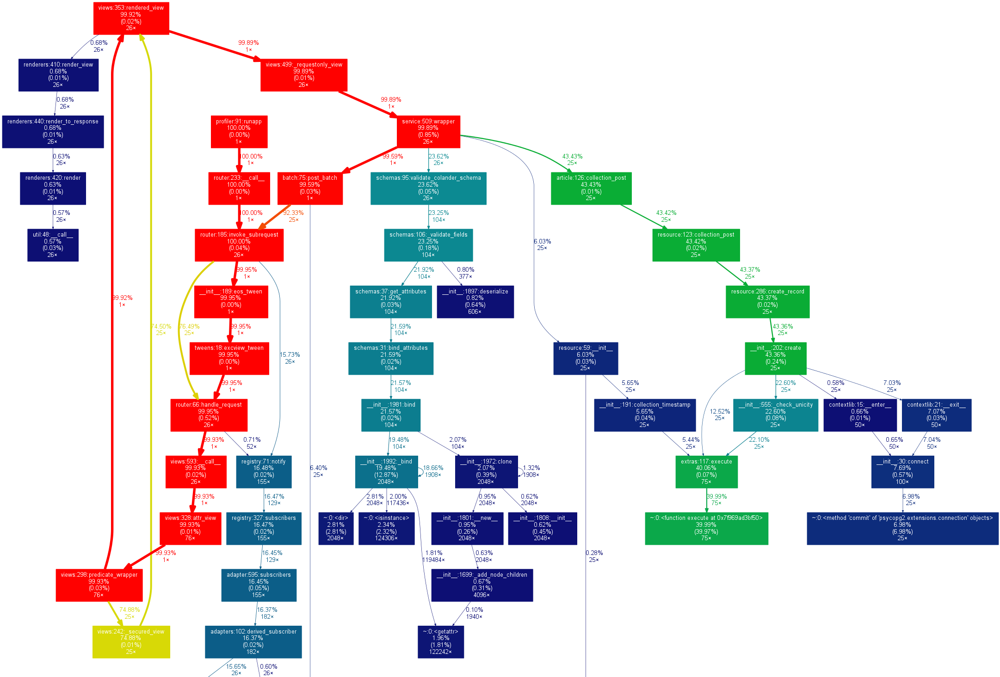

.. |br| raw:: html

    

Cliquet
#######

A toolkit to build HTTP (micro)services.

* Python Meetup Barcelona
* July 2015
* https:/cliquet.readthedocs.io

----

Mathieu Leplatre
================

* @leplatrem
* French, *«Mateo»*
* Toulouse, Cartography
* Barcelona, Mozilla  *(remote, BetaHaus)*
* Python *(++)* JavaScript *(+)*
* Backend *(++)* Frontend *(+)*

----

Highlights
==========

    * Origins
    * Concepts
    * Toolkit
    * Conversation

----

Origins
=======

----

*Origins:* The « storage » team
===============================

* http://servicedenuages.fr *(aka the Frenchies)*
* ``#storage`` on irc.mozilla.org
* @ametaireau, @Natim, @n1k0, @phrawzty, @tarek_ziade
* Met around 2010 *(DjangoCon)*
* Work together in 2015 \\o/

.. image:: images/storage-team.jpg
    :width: 100%

----

*Origins:* Reading List server
==============================

* CANIHAZ the specs |br| *(Super powers of the newcomer)*
* No central knowledge *(Many services)*
* Offline synchronization *(Firefox Sync)*
* Started with Python-Eve *(Specific DSL ☹)*
* Architecture with two services *(Start reusing!)*

----

*Origins:* Main idea
====================

* Enforce good practices *(Quickstart)*
* Enforce production standards *(Quality)*
* Implement a protocol *(Reuse client code)*
* Everything pluggable *(Toolkit)*

.. image:: images/cliquet.svg
    :align: right

----

Concepts
========

----

*Concepts:* Good practices
==========================

- API version prefix *(v1)*
- HTTP status codes *(304, 307, 412, 409, ...)*
- HTTP headers *(CORS, Content, Authorization, )*
- REST CRUD *(PUT create|replace, PATCH, ...)*

.. image:: images/explain-basics.jpg
    :align: right
    :width: 400px

----

*Concepts:* Production
======================

Deployment and operation:

* Configuration *(.ini, env vars)*
* Monitoring *(StatsD, Sentry, NewRelic)*
* Logging *(JSON)*

.. image:: images/cloud-services.png
    :align: right

As well as standard HTTP endpoints...

----

*Concepts:* Protocol (1/2)
==========================

Endpoints for Ops:

* «Hello» endpoint ``GET /v1/`` |br| *(docs URL, settings values)*
* Monitoring endpoint *(* ``GET /v1/__heartbeat__`` *)*

Unadvertised:

* Error channel *(JSON, error codes)*
* Backoff headers *(Maintenance, overload)*
* End-of-life headers *(API Deprecation)*

→ Only works if clients are aware of them !

----

*Concepts:* Protocol (2/2)
==========================

For REST resources:

* JSON structure *(Bikeshed!)*
* Schema validation
* Querystring syntax *(filter, sort)*
* Concurrency control *(ETags)*
* Polling for changes *(Offline sync)*

``GET /v1/articles?status=3&_sort=-added``

Generic:

* Batch requests  *(* ``POST /v1/batch`` *)*

----

*Concepts:* Pluggability
========================

* Unplug | Plug | Override

.. image:: images/cliquet-base.png
    :align: right
* Works with defaults
* Abstractions for backends
* Agnostic authentication
* Control from configuration
----

Toolkit
=======

----

*Toolkit:* Stack
================

*Cliquet* is:

* an **implementation of the protocol** in Python
* with **good practices** for production
* and **pluggability** in mind.

Using:

* Pyramid *(HTTP framework)*
* Cornice *(Reduce REST boilerplate)*

→ Beyond scope of Cliquet: code as usual.

----

*Toolkit:* Enable
=================

.. code-block:: python
    :emphasize-lines: 1,7

    import cliquet
    from pyramid.config import Configurator

    def main(global_config, **settings):
        config = Configurator(settings=settings)

        cliquet.initialize(config, version='1.0')
        return config.make_wsgi_app()

→ Enjoy !

.. code-block:: json

    $ http GET "http://localhost:8000/v1/__heartbeat__"
    HTTP/1.1 200 OK
    ...
    {
        "cache": true,
        "permission": true,
        "storage": true
    }

----

*Toolkit:* Add a REST resource
==============================

.. code-block:: python
    :emphasize-lines: 6,7,8

    from cliquet import resource, schema

    class BookmarkSchema(schema.ResourceSchema):
        url = schema.URL()

    @resource.register()
    class Bookmark(resource.BaseResource):
        mapping = BookmarkSchema()

→ Enjoy !

.. code-block:: json

    $ http GET "http://localhost:8000/v1/bookmarks"
    HTTP/1.1 200 OK
    ...
    {
        "data": [
            {
                "url": "http://cliquet.readthedocs.io",
                "id": "cc103eb5-0c80-40ec-b6f5-dad12e7d975e",
                "last_modified": 1437034418940,
            }
        ]
    }

----

*Toolkit:* Take control
=======================

...of endpoints and behaviour!

.. code-block:: python
    :emphasize-lines: 1,2,3,7,8,9,10,11

    @resource.register(collection_path='/user/bookmarks',
                       record_path='/user/bookmarks/{{id}}',
                       collection_methods=('GET',))
    class Bookmark(resource.BaseResource):
        mapping = BookmarkSchema()

        def process_record(self, new, old=None):
            if new['device'] != old['device']:
                device = self.request.headers.get('User-Agent')
                new['device'] = device
            return new

----

*Toolkit:* Take control
=======================

...of schema and fields!

.. code-block:: python
    :emphasize-lines: 1,5,6,8,9,10

    import colander

    class BookmarkSchema(resource.ResourceSchema):
        url = schema.URL()
        title = colander.SchemaNode(colander.String())
        device = colander.SchemaNode(colander.String(), missing='')

        class Options:
            readonly_fields = ('device',)
            unique_fields = ('url',)

----

*Toolkit:* Custom views
=======================

Use abstractions with Pyramid or Cornice !

.. code-block:: python
    :emphasize-lines: 13,14

    from cliquet import Service

    score = Service(name="score",
                    path='/score/{game}',
                    description="Store game score")

    @score.post(schema=ScoreSchema)
    def post_score(request):
        collection_id = 'scores-' + request.match_dict['game']
        user_id = request.authenticated_userid
        value = request.validated  # c.f. Cornice.

        storage = request.registry.storage
        record = storage.create(collection_id, user_id, value)
        return record

----

*Toolkit:* Configure
====================

From ``application.ini``:

.. code-block:: ini

    cliquet.storage_backend = cliquet.storage.redis
    cliquet.storage_url = redis://localhost:6379/0
    cliquet.statsd_url = udp://localhost:8125
    cliquet.logging_renderer = cliquet.logs.MozillaHekaRenderer

From environment variables...

.. code-block:: yml

    # docker-compose.yml
    db:
      image: postgres
      environment:
        POSTGRES_USER: postgres
        POSTGRES_PASSWORD: postgres
    web:
      links:
       - db
      environment:
        CLIQUET_CACHE_BACKEND: cliquet.cache.postgresql
        CLIQUET_CACHE_URL: postgres://postgres:postgres@db/postgres
        CLIQUET_STORAGE_BACKEND: cliquet.storage.postgresql
        CLIQUET_STORAGE_URL: postgres://postgres:postgres@db/postgres

----

*Toolkit:* Authentication
=========================

* Pyramid eco-system
* Agnostic
* Pluggable *(from configuration)*
* Firefox Account at Mozilla *(extension cliquet-fxa)*

----

*Toolkit:* Profiling
====================

Using Werkzeug middleware:

.. code-block:: python
  :emphasize-lines: 4,5

  def main(global_config, **settings):
      config = Configurator(settings=settings)
      cliquet.initialize(config, __version__)
      app = config.make_wsgi_app()
      return cliquet.install_middlewares(app)

.. code-block:: ini

    cliquet.profiler_enabled = true
    cliquet.profiler_dir = /tmp/profiling

----

Microservices ?
===============

*Cliquet* brings:

* Standard configuration
* Standard deployment
* Standard monitoring
* Standard protocol

For developers:

* No boilerplate code
* Lightweight toolkit for CRUD
* Abstraction for backends

----

For you ?
=========

.. image:: images/golden-toothbrush.png
    :align: right
    :width: 50%

*Cliquet* is not a «*golden hammer*».

* Protocol ?
* CRUD ?
* Storage ?
* Monitoring ?
* Production constraints ?

→ Boilerplate vs. dependencies.

----

Dogfooding
==========

* *Reading List*, store and synchronize articles
* *Kinto*, a generic storage service |br| *(with JavaScript and Python clients)*

→ Improve documentation

* Specifications vs. implementation |br| *(Protocol vs. toolkit)*

----

Conversation
============
