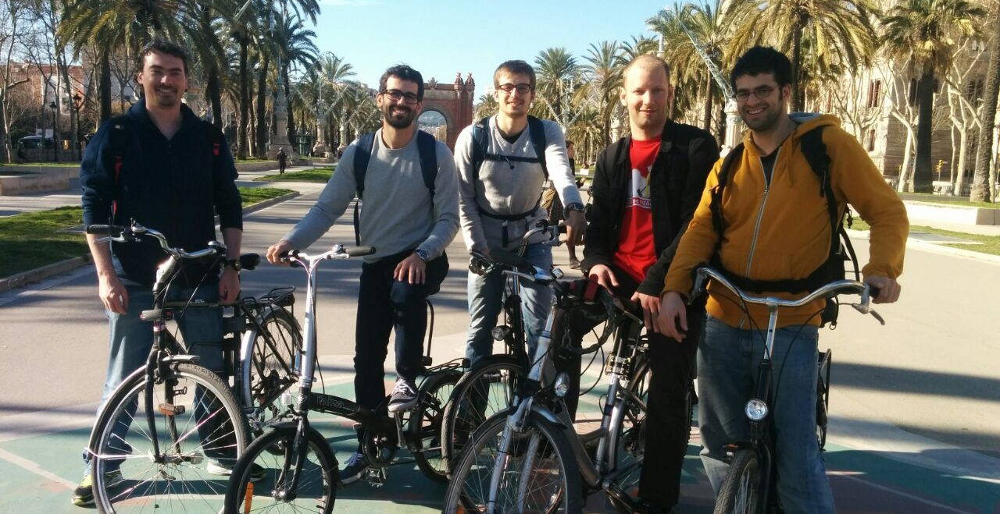
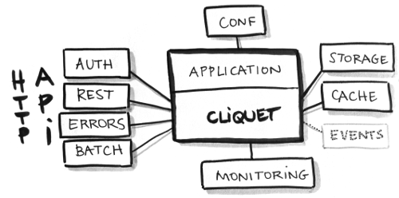

.. |br| raw:: html

    

.. |tab| raw:: html

   &nbsp;

.. |small| raw:: html

   

.. |x-small| raw:: html

   

.. |xx-small| raw:: html

   

Cliquet
#######

A toolkit to build HTTP (micro)services.

* PyconFR
* October 2015
* https:/cliquet.readthedocs.io

----

Highlights
==========

    * Origins
    * Protocol
    * Toolkit
    * Conversation

----

Origins
=======

----

*Origins:* The « storage » team
===============================

* http://servicedenuages.fr
* @ametaireau, @leplatrem, @Natim, @n1k0, @phrawzty, @tarek_ziade
* Met around 2010 *(Makina Corpus, DjangoCon)*
* Same team in 2015 \\o/

----

*Origins:* Reading List server
==============================

* We do APIs.
* CANIHAZ the specs |br| *(Super powers of the newcomer)*

----

*Origins:* Reuse efforts
========================

* HTTP know-how
* REST API design
* Synchronization protocol
* Production standards

→ We want **a protocol**.

----

*Origins:* Reuse code
=====================

* Quickstart
* Go live on day #1
* Everything optional and pluggable

→ We want **a toolkit**.

.. image:: images/cliquet.svg
    :align: right

----

HTTP Protocol
=============

----

*Protocol:* Good practices
==========================

- API major version prefix *(/v1)*
- Standard headers *(CORS, Content, Authorization, )*
- Standard status codes *(304, 412, 409, ...)*
- REST CRUD *(PUT create|replace, PATCH, ...)*

----

*Protocol:* Service & Operations
================================

* «Hello» endpoint ``GET /v1/`` |br| *(docs URL, settings values)*
* Monitoring endpoint *(* ``GET /v1/__heartbeat__`` *)*
* Batch multiple requests  *(* ``POST /v1/batch`` *)*

----

*Protocol:* Service & Operations
================================

* Error channel *(JSON responses, error codes)*
* Backoff headers *(Maintenance, overload)*
* End-of-life headers *(API Deprecation)*

→ Common code in API consumers!

----

*Protocol:* REST resource
=========================

*Usual but optional*

* JSON payload structure *(Bikeshed!)*
* Querystring syntax *(Filter, sort)*
* Concurrency control *(ETags headers)*
* Polling for changes *(Offline sync)*

``GET /v1/articles?status=3`` |br| ``GET /v1/articles?_sort=-added`` |br| ``GET /v1/articles?_since=11290876567``

----

*Protocol:* REST resource
=========================

* Schema validation *(Error format)*
* |small| Token based pagination
* |x-small| Permissions
* |xx-small| Transactions
* ...

----

*Protocol:* RFC?
================

* Empirical approach *(Move fast)*
* Towards stabilization *(Going live)*
* Start with implementation in Python *(What else?)*

----

Toolkit
=======

----

*Toolkit:* Implementation
=========================

*Cliquet* is:

* an **implementation of the protocol** in Python
* with **good practices** for production
* and **pluggability** in mind.

----

*Toolkit:* Stack
================

* Pyramid *(HTTP framework)*
* Cornice *(Reduce REST boilerplate)*

→ Beyond scope of Cliquet: as usual.

----

*Toolkit:* Enable
=================

.. code-block:: python
    :emphasize-lines: 1,7

    import cliquet
    from pyramid.config import Configurator

    def main(global_config, **settings):
        config = Configurator(settings=settings)

        cliquet.initialize(config, version='1.0')
        return config.make_wsgi_app()

→ Enjoy !

.. code-block:: json

    $ http GET "http://localhost:8000/v1/__heartbeat__"
    HTTP/1.1 200 OK
    ...
    {
        "cache": true,
        "permission": true,
        "storage": true
    }

----

*Toolkit:* Custom views
=======================

Use Cliquet abstractions with Pyramid or Cornice !

.. code-block:: python
    :emphasize-lines: 13,14

    from cliquet import Service

    score = Service(name="score",
                    path='/score/{game}',
                    description="Store game score")

    @score.post(schema=ScoreSchema)
    def post_score(request):
        collection_id = 'scores-' + request.match_dict['game']
        user_id = request.authenticated_userid
        value = request.validated  # c.f. Cornice.

        storage = request.registry.storage
        record = storage.create(collection_id, user_id, value)
        return record

----

*Toolkit:* Add a REST resource
==============================

.. code-block:: python
    :emphasize-lines: 6,7,8

    from cliquet import resource, schema

    class BookmarkSchema(schema.ResourceSchema):
        url = schema.URL()

    @resource.register()
    class Bookmark(resource.BaseResource):
        mapping = BookmarkSchema()

→ Enjoy !

.. code-block:: json

    $ http GET "http://localhost:8000/v1/bookmarks"
    HTTP/1.1 200 OK
    ...
    {
        "data": [
            {
                "url": "http://cliquet.readthedocs.io",
                "id": "cc103eb5-0c80-40ec-b6f5-dad12e7d975e",
                "last_modified": 1437034418940,
            }
        ]
    }

----

*Toolkit:* Take control
=======================

...of endpoints and behaviour!

.. code-block:: python
    :emphasize-lines: 1,2,3,7,8,9,10,11

    @resource.register(collection_path='/user/bookmarks',
                       record_path='/user/bookmarks/{{id}}',
                       collection_methods=('GET',))
    class Bookmark(resource.BaseResource):
        mapping = BookmarkSchema()

        def process_record(self, new, old=None):
            if new['device'] != old['device']:
                device = self.request.headers.get('User-Agent')
                new['device'] = device
            return new

----

*Toolkit:* Take control
=======================

...of schema and fields!

.. code-block:: python
    :emphasize-lines: 1,5,6,8,9,10

    import colander

    class BookmarkSchema(resource.ResourceSchema):
        url = schema.URL()
        title = colander.SchemaNode(colander.String())
        device = colander.SchemaNode(colander.String(), missing='')

        class Options:
            readonly_fields = ('device',)
            unique_fields = ('url',)

----

*Toolkit:* Pluggability
=======================

* Unplug | Plug | Override

* **From configuration**
* Lightweight by default
* Abstractions for backends

----

*Toolkit:* Authentication
=========================

* Pyramid eco-system
* Agnostic *(multiauth)*
* Pluggable *(from configuration)*
* Firefox Account at Mozilla *(extension cliquet-fxa)*

----

*Toolkit:* Deployment
=====================

Standard deployment:

* Flat configuration *(.ini, env vars)*
* Monitoring components *(StatsD, Sentry, NewRelic)*
* Logging renderers *(JSON, Heka)*

----

*Toolkit:* Configuration
========================

From ``application.ini``:

.. code-block:: ini

    cliquet.storage_backend = cliquet.storage.redis
    cliquet.storage_url = redis://localhost:6379/0
    cliquet.statsd_url = udp://localhost:8125
    cliquet.logging_renderer = cliquet.logs.CustomRenderer

From environment variables...

.. code-block:: yml

    # docker-compose.yml
    db:
      image: postgres
      environment:
        POSTGRES_USER: postgres
        POSTGRES_PASSWORD: postgres
    web:
      links:
       - db
      environment:
        CLIQUET_CACHE_BACKEND: cliquet.cache.postgresql
        CLIQUET_CACHE_URL: postgres://postgres:postgres@db/postgres
        CLIQUET_STORAGE_BACKEND: cliquet.storage.postgresql
        CLIQUET_STORAGE_URL: postgres://postgres:postgres@db/postgres

----

*Toolkit:* Profiling
====================

Using Werkzeug middleware:

.. code-block:: python
  :emphasize-lines: 4,5

  def main(global_config, **settings):
      config = Configurator(settings=settings)
      cliquet.initialize(config, __version__)
      app = config.make_wsgi_app()
      return cliquet.install_middlewares(app)

.. code-block:: ini

    cliquet.profiler_enabled = true
    cliquet.profiler_dir = /tmp/profiling

.. image:: images/profile-example.png
    :height: 300px

----

Microservices ?
===============

*Cliquet* brings:

* Standard configuration
* Standard deployment
* Standard monitoring
* Standard service protocol

----

Microservices ?
===============

For developers:

* No boilerplate code
* Focus on business
* Prototypes can go to production :)
* Abstraction for backends
* Reuse API client code

----

For you ?
=========

*Cliquet* is not a «*golden hammer*».

* Protocol ?
* |tab| Monitoring ?
* |tab| |tab| Storage|cache ?
* |tab| |tab| |tab| CRUD ?

----

Dogfooding
==========

* *Reading List*, store and synchronize articles
* *Kinto*, a generic storage service |br| *(with JavaScript and Python clients)*
* *SyncTo*, a proxy to Firefox Sync API for ``kinto.js``

.. image:: images/kinto.svg
    :align: right

----

Conversation
============
